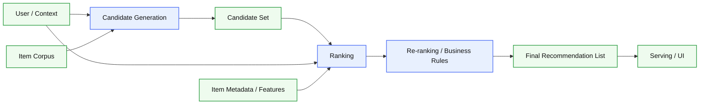
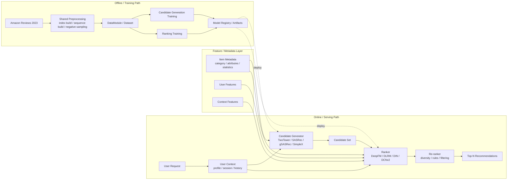
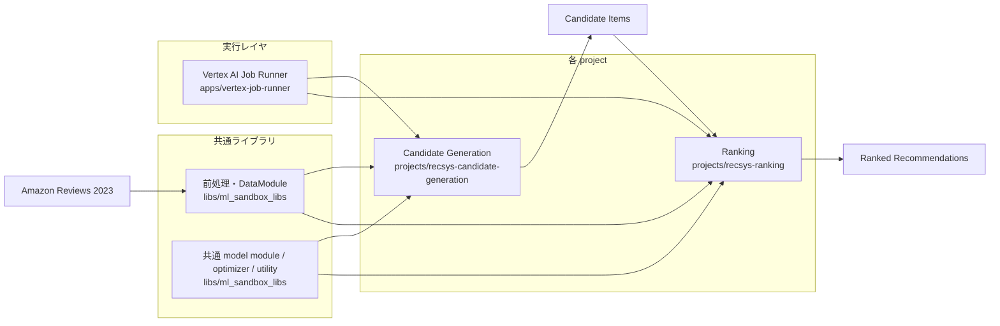
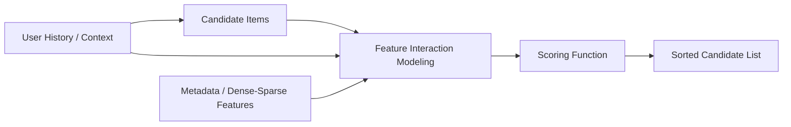
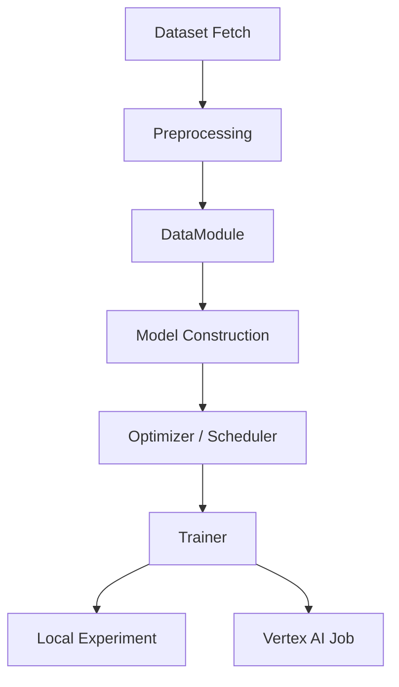

# ML-Sandbox

[](https://github.com/haru-256/ml-sandbox/actions/workflows/python-ci.yml)

`ml-sandbox` は、推薦システムを中心に機械学習モデルの実装、実験、基盤整備を進める Python monorepo です。主な対象は `projects/recsys-candidate-generation` と `projects/recsys-ranking` で、候補生成とランキングを別 project として切り出し、その下支えとなる前処理、DataModule、共通 model module、optimizer、学習 utility は `libs/ml_sandbox_libs` に集約しています。実験の実行基盤は `apps/vertex-job-runner` に分離しており、model 実装だけでなく shared library 化とクラウド実行まで含めて設計しています。

技術スタックは Python 3.12 を前提に、`uv` と Makefile で package ごとに開発し、PyTorch、Lightning、Hydra、Polars、NumPy、TorchMetrics、PyTorch Geometric、Google Cloud / Vertex AI を中心に組み立てています。コードベースとしては、project ごとの関心を分けつつ shared component を明確に切り出し、型注釈、`mypy`、`ruff`、`pytest`、GitHub Actions を前提に保守している repo です。

この README は、最初に全体像を短く把握できるようにしつつ、後半で各 project の問題設定、モデル、アーキテクチャ、設計方針まで辿れるように構成しています。

## このリポジトリについて

このリポジトリでは、主に次のようなテーマを扱っています。

- 推薦システム:
  Multi-Stage Recommendation Architecture、Candidate Generation / Retrieval、Ranking、Sequential Recommendation、CTR / CVR を意識した特徴量相互作用モデリング
- 機械学習実験基盤:
  Hydra を使った設定管理、PyTorch / Lightning を使った学習ループ、共通ライブラリ化による再利用性向上、Vertex AI へのジョブ投入
- データ処理:
  Amazon Reviews 2023 を使った推薦用前処理、user / item / category index 構築、sequence 化、negative sampling、metadata の統合

このリポジトリは、単にモデルを個別実装するだけでなく、問題設定ごとの project 分離、共通ライブラリ化、クラウド実行基盤の整備まで含めて設計しています。

## リポジトリ構成

```text
ml-sandbox/
├── apps/                      # 実行アプリケーション・CLI
│   └── vertex-job-runner
├── libs/                      # 複数 project で再利用する内部ライブラリ
│   └── ml_sandbox_libs
├── projects/                  # 問題設定ごとの ML project
│   ├── recsys-candidate-generation
│   ├── recsys-ranking
│   └── sentiment_analysis
└── infra/                     # Terraform などのインフラ定義
```

役割の分け方は次の通りです。

| Path | Role |
| --- | --- |
| `projects/recsys-candidate-generation` | 候補生成 / retrieval の実験と学習 |
| `projects/recsys-ranking` | ranking の実験と学習 |
| `libs/ml_sandbox_libs` | 前処理, DataModule, model module, loss, optimizer, utility の共通化 |
| `apps/vertex-job-runner` | Vertex AI に job を投げる実行レイヤ |
| `infra/terraform` | インフラ管理 |

## 技術スタック

### 言語

- Python 3.12

### ML / DL

- PyTorch
- Lightning
- TorchMetrics
- timm
- PyTorch Geometric

### 設定管理 / 実験管理

- Hydra
- `pyproject.toml`
- `uv`
- Makefile

### データ処理

- Polars
- NumPy
- datasets

### 開発ツール

- Ruff
- mypy
- pytest
- GitHub Actions

### クラウド / インフラ

- Google Cloud Vertex AI
- Terraform

## 推薦システム全体アーキテクチャ

推薦システム全体の問題設定として、以下のような multi-stage architecture を前提にしています。



### なぜこれが重要か

大規模推薦では、全 item を精密に score することは計算量的に難しいため、通常は以下の責務分離が必要になります。

- Candidate Generation:
  大規模 item 集合から、関連性の高そうな候補を高速に絞る。重要なのは recall を落としすぎないことです。
- Ranking:
  候補集合に対して、より表現力の高いモデルで精密にスコアリングする。特徴量相互作用や target-aware modeling が重要です。
- Re-ranking:
  多様性、在庫、ビジネスルール、露出制御などを反映します。

このリポジトリでは、特に Candidate Generation と Ranking を別 project として切り出し、問題設定と設計判断を分離しています。

## 推薦システムアーキテクチャ図

推薦システム全体像を、自分の実装関心に寄せて表現すると次のようになります。
この図では、大規模 item corpus からの候補生成、特徴量を使った ranking、business rule を反映する re-ranking、serving までを 1 本の流れとして整理しています。



### 図の見方

- Offline / Training Path:
  Amazon Reviews 2023 を共通前処理し、Candidate Generation 用・Ranking 用の学習データを構築します。学習済みモデルや artifact を管理し、online path に deploy します。
- Candidate Generator:
  大規模 corpus から候補を高速に絞る層です。recall を重視し、user/item representation learning や sequence modeling が中心です。
- Ranker:
  候補集合に対して、特徴量相互作用を用いて score する層です。user history、target item、metadata、dense/sparse features を統合します。
- Re-ranker:
  ビジネスルール、多様性、フィルタリングなどを反映して最終リストを作る層です。
- Serving:
  online request に対して段階的に candidate を絞り、最終的な Top-N を返す層です。

## モノレポ全体の構成



この図では、データセット、共通ライブラリ、各 project、実行レイヤの関係を分けて示しています。

- `libs/ml_sandbox_libs` は前処理・DataModule・共通 module を提供
- `projects/recsys-candidate-generation` と `projects/recsys-ranking` はそれらを利用して学習・実験を実施
- `apps/vertex-job-runner` は各 project の実行を補助
- Candidate Generation の出力が Ranking の入力になる

### Projects

ここがこのリポジトリの中心です。
特に推薦システム領域において、検索・候補生成・ランキングという構成に近い問題設定を扱っています。

### Recsys Candidate Generation

`projects/recsys-candidate-generation`

推薦システムにおける Candidate Generation（候補生成 / Retrieval）を扱う project です。
大規模な item 集合から、各 user に対して関連性の高い候補を高速に絞り込む段階を対象にしています。

#### 技術的な焦点

- Sequential Recommendation:
  user の時系列行動履歴から次に関心を持つ item を予測します。
- Collaborative Filtering / Retrieval:
  user-item 相互作用から user / item representation を学習し、候補を取得します。
- Negative Sampling:
  正例と負例の対比による efficient training を扱います。
- Representation Learning:
  retrieval quality を高めるための embedding 学習を扱います。

#### 実装しているモデル

- `TwoTower`
- `SASRec`
- `gSASRec`
- `SimpleX`

#### Candidate Generation モデル比較

| Model | Category | Main Input | Core Idea | Strength | Typical Use Case |
|---|---|---|---|---|---|
| `TwoTower` | Retrieval / dual-encoder | user ID, item ID, optional user/item features | user tower と item tower を独立に学習し、embedding 類似度で候補取得 | serving しやすい、ANN と相性が良い、実運用に載せやすい | large-scale retrieval |
| `SASRec` | Sequential Recommendation | user interaction sequence | self-attention で行動履歴の依存関係を表現し、次 item を予測 | sequence の文脈を捉えやすい | next-item prediction |
| `gSASRec` | Sequential Recommendation | user interaction sequence | SASRec に gBCE 系の考え方を導入し、negative sampling 起因の過信を抑制 | hard negative に対する学習安定性を意識できる | robust sequential retrieval |
| `SimpleX` | Collaborative Filtering | user history, item interactions | user history の単純集約と contrastive 的な学習を組み合わせる | 実装が比較的シンプルで強い baseline になりやすい | strong CF baseline |

#### この project の技術的な意味

この project では、単に推薦モデルを実装しただけではなく、以下の論点を扱っています。

- retrieval と ranking は目的関数も制約も異なる
- sequence modeling は retrieval quality に直接効く
- embedding 学習は ANN 検索や serving 設計と接続しやすい
- negative sampling の設計は性能と学習安定性に強く影響する

#### 参考論文

| Topic / Model | Paper | Link |
|---|---|---|
| Dataset | Bridging Language and Items for Retrieval and Recommendation | <https://arxiv.org/abs/2403.03952> |
| SASRec | Self-Attentive Sequential Recommendation | <https://arxiv.org/abs/1808.09781> |
| gSASRec | Reducing Overconfidence in Sequential Recommendation Trained with Negative Sampling | <https://arxiv.org/abs/2308.07192> |
| SimpleX | SimpleX: A Simple and Strong Baseline for Collaborative Filtering | <https://arxiv.org/abs/2109.12613> |

詳細は [`projects/recsys-candidate-generation/README.md`](projects/recsys-candidate-generation/README.md) を参照してください。

### Recsys Ranking

`projects/recsys-ranking`

推薦システムにおける Ranking 段階を扱う project です。
Candidate Generation で取得した候補 item に対して、より表現力の高いモデルで精密に順位付けする段階を対象にしています。

#### Ranking 段階のイメージ



Ranking では、candidate generation よりも豊かな特徴量相互作用を扱えるため、

- user の履歴
- target item
- category などの side information
- dense / sparse feature

を統合して、クリックや購買に近い signal を学習しやすくなります。

#### 技術的な焦点

- CTR / ranking 向け deep models
- Feature Interaction Modeling
- Behavior Sequence Aggregation
- Attention-based User Interest Modeling
- Cross Network と MLP の比較
- Hydra を使った実験設定の切り替え

#### 実装しているモデル

- `DeepFM`
- `DLRM`
- `DIN`
- `DCNv2`

#### Ranking モデル比較

| Model | Category | Main Input | Core Idea | Strength | Typical Use Case |
|---|---|---|---|---|---|
| `DeepFM` | CTR / ranking | sparse categorical features, item history | FM で低次相互作用、DNN で高次相互作用を同時に扱う | wide & deep 系の代表、実装と解釈のバランスが良い | baseline ranking |
| `DLRM` | Recommendation ranking | dense + sparse features | sparse embedding と dense MLP を分離し、interaction layer で統合 | 実務で使いやすい構成、feature engineering と相性が良い | production-style ranking |
| `DIN` | Interest modeling | user behavior sequence, target item | target-aware attention により、ターゲットごとに user interest を動的抽出 | 行動履歴の relevance を item ごとに変えられる | personalized CTR prediction |
| `DCNv2` | Feature interaction | sparse / dense features, history representation | cross network と deep network を併用して explicit / implicit interaction を同時に学習 | cross feature を強く扱える、強力な ranking model | advanced feature interaction modeling |

#### この project の技術的な意味

この project では、単純な分類モデルではなく、推薦特有の

- 履歴系列の扱い
- target-aware attention
- feature crossing
- sparse / dense feature の統合

といった、広告・EC・推薦において実務的に重要な論点を実装対象にしています。

#### 参考論文

| Topic / Model | Paper | Link |
|---|---|---|
| DeepFM | DeepFM: A Factorization-Machine based Neural Network for CTR Prediction | <https://arxiv.org/abs/1703.04247> |
| DLRM | Deep Learning Recommendation Model for Personalization and Recommendation Systems | <https://arxiv.org/abs/1906.00091> |
| DIN | Deep Interest Network for Click-Through Rate Prediction | <https://arxiv.org/abs/1706.06978> |
| DCNv2 | DCN V2: Improved Deep & Cross Network and Practical Lessons for Web-scale Learning to Rank Systems | <https://arxiv.org/abs/2008.13535> |

詳細は [`projects/recsys-ranking/README.md`](projects/recsys-ranking/README.md) を参照してください。

## 共通ライブラリ

### ml_sandbox_libs

`libs/ml_sandbox_libs`

複数 project で再利用するための内部 library です。
このリポジトリの設計思想をよく表しているディレクトリのひとつです。

### 役割

- Amazon Reviews 2023 の共通前処理
- user / item / category index の構築
- sequential recommendation 用 DataModule
- graph recommendation に拡張可能な preprocessing
- recommendation 向け共通 model module
- optimizer / lr scheduler
- training utilities

### なぜ重要か

この library があることで、

- project ごとに同じ preprocessing を書き直さない
- optimizer や training monitor の実装が重複しない
- recommendation 実験を増やしても codebase が崩れにくい

というメリットがあります。

継続的に ML project を増やしていく前提の構造になっています。

詳細は [`libs/ml_sandbox_libs/README.md`](libs/ml_sandbox_libs/README.md) を参照してください。

## 実験実行レイヤ

### vertex-job-runner

`apps/vertex-job-runner`

Google Cloud Vertex AI の Custom Training Job を実行するための CLI です。
実験コードそのものではなく、実験をクラウド上で再現性高く実行するための基盤です。

### できること

- `pyproject.toml` の `[tool.vrun]` を使った設定管理
- 環境変数と CLI option による上書き
- dry-run による job 設定の確認
- project ごとの training entrypoint の共通実行

## 実験フロー



このフローは、`projects/*` にある training code と、`libs/*`, `apps/*` の役割分担を要約したものです。

## 設計方針

このリポジトリでは、次のような方針を取っています。

### 1. project ごとの関心を分離する

- Candidate Generation と Ranking は分ける
- project 固有の model composition は project 側に置く
- shared 化できるものだけ `libs` に置く

### 2. 実験コードを再利用可能な資産として扱う

- DataModule を shared 化する
- optimizer / utility を共通化する
- import path と package 構造を整理する

### 3. ローカル実験とクラウド実行を両立する

- local package を monorepo 内で参照
- `uv` と `Makefile` で package 単位に操作
- Vertex AI 実行を CLI に分離

## 開発の基本

Python 関連コマンドは package root で `uv` 前提の Makefile を使います。

```sh
cd libs/ml_sandbox_libs && make install && make lint && make test
cd projects/recsys-ranking && make install && make lint && make test
cd projects/recsys-candidate-generation && make install && make lint && make test
cd apps/vertex-job-runner && make install && make lint && make test
```

基本ルール:

- `python`, `pip`, `pytest` を直接実行しない
- package root でコマンドを実行する
- shared library を変更した場合は downstream project 影響も確認する

## 関連 README

- [`projects/recsys-candidate-generation/README.md`](projects/recsys-candidate-generation/README.md)
- [`projects/recsys-ranking/README.md`](projects/recsys-ranking/README.md)
- [`projects/sentiment_analysis/README.md`](projects/sentiment_analysis/README.md)
- [`libs/ml_sandbox_libs/README.md`](libs/ml_sandbox_libs/README.md)
- [`apps/vertex-job-runner/README.md`](apps/vertex-job-runner/README.md)
