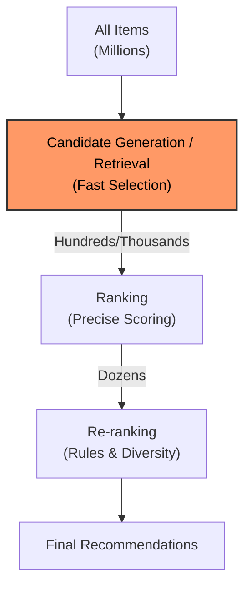

# RecSys Candidate Generation

## Overview

このリポジトリには、推薦システムの重要な段階である **Candidate Generation (候補生成)** の実験コードが含まれています。

### Problem Setting: Candidate Generation / Retrieval

大規模な推薦システムでは、計算コストの制約から、全てのアイテムをすべてのユーザーに対してランキングすることは困難です。そのため、一般的に **Multi-Stage Architecture** が採用されます。

1. **Candidate Generation (Retrieval)**: 数百万〜数億のアイテム群から、ユーザーに関連性の高い数百〜数千の候補アイテムを高速に選抜する段階。
2. **Ranking**: 選抜された候補アイテムに対して、より複雑なモデルを用いて正確なスコアリングと順位付けを行う段階。
3. **Re-ranking**: 多様性やビジネスルールなどを考慮して最終的なリストを作成する段階。



本リポジトリは、このうち **Step 1: Candidate Generation** に焦点を当てています。
目標は、膨大なアイテムコーパス $I$ から、ユーザー $u$ が次に関心を持つ可能性が高いアイテム部分集合 $C_u \subset I$ ($|C_u| \ll |I|$) を効率的に検索することです。

#### Methods

Candidate Generationのアプローチとして、本リポジトリでは主に以下の2つを扱います。

- **Sequential Recommendation**:
    - ユーザーの過去の行動履歴（シーケンス）を入力とし、文脈を考慮して次のアイテムを予測します。
    - 代表例: SASRec, gSASRec
- **General / Collaborative Filtering**:
    - ユーザーIDやアイテムID、その他特徴量を用いてユーザーとアイテムの類似性を学習します。
    - 代表例: TwoTower, SimpleX

#### Training Objective

多くのモデルでは、**Negative Sampling** を用いた学習が行われます。
正例（ユーザーが実際にインタラクションしたアイテム）と、ランダムまたは重要度に基づいてサンプリングされた負例（インタラクションしていないアイテム）を区別するようにモデルを訓練します。

## データセット

実験には **[Amazon Reviews 2023](https://amazon-reviews-2023.github.io/)** (McAuley Lab) の **Video Games** カテゴリを使用しています。

- **Source**: [Amazon Reviews 2023](https://amazon-reviews-2023.github.io/)
- **Category**: Video Games

### Features

データセットには以下のリッチな特徴が含まれています。

- **User Reviews**: 評価 (Rating), テキスト, 投票数など
- **Item Metadata**: 商品説明, 価格, 画像, カテゴリなど
- **Links**: User-Item グラフ, Co-purchase グラフなど

### Preprocessing & Configuration

本実験では、**"0core_timestamp_w_his"** 設定を採用しています。これは、ユーザーの行動履歴を時系列順に並べたシーケンスとして扱う設定です。

主な前処理パイプライン (`libs/ml_sandbox_libs` に実装):

1. **Filtering**:
   - 出現頻度の低いユーザーやアイテムを `UNK` (Unknown) トークンとして扱います。
   - インタラクション履歴が空のユーザーを除外します。
2. **Sequentialization**:
   - 各ユーザーについて、レビューを行ったアイテムをタイムスタンプ順にソートし、シーケンス（履歴）を作成します。
   - `max_seq_len` に合わせて、古い履歴の切り捨て (Truncate) またはパディング (Pad) を行います。
3. **Negative Sampling**:
   - 学習および評価時に、正例アイテムに対してランダムに負例アイテムをサンプリングします。
4. **Metadata Integration**:
   - アイテムのカテゴリ情報や平均評価などをメタデータとして統合し、モデルの入力として利用可能にします。

- **Paper**: [Bridging Language and Items for Retrieval and Recommendation](https://arxiv.org/abs/2403.03952)

## ディレクトリ構成

```sh
recsys-candidate-generation/
├── compose.vertexai.yaml   # Vertex AI 用の Docker Compose 設定
├── Dockerfile.vertexai     # Vertex AI 用の Dockerfile
├── Makefile                # ビルドやテストなどのコマンド定義
├── pyproject.toml          # Python プロジェクト設定 (依存関係など)
├── README.md               # このファイル
├── uv.lock                 # uv ロックファイル
├── results/                # 実験結果 (ログ、アーティファクトなど)
│   ├── artifact/           # モデルのアーティファクトなど
│   ├── dataset/            # データセット関連 (キャッシュなど)
│   └── logs/               # トレーニングログ
└── src/                    # ソースコード
    ├── fit.py              # トレーニングスクリプト
    ├── config/             # 設定ファイル (Hydra など)
    ├── const/              # 定数定義
    ├── models/             # モデル定義
    ├── my_types/           # 型定義
    └── tests/              # テストコード
```

## モデル

具体的には以下のモデルを実装する予定です。

- [x] TwoTower: Two-Tower Model
    - ユーザーとアイテムを独立したタワー（ニューラルネットワーク）でエンベディングし、その類似度（例：内積）を計算して推薦を行うモデル。
- [ ] MF: Matrix Factorization
- [ ] Collaborative Filtering
- [ ] NCF: Neural Collaborative Filtering
- [ ] NeuMF: Neural Matrix Factorization
- [ ] NGCF: Neural Graph Collaborative Filtering
- [ ] LightGCN
- [ ] GRU4Rec: Gated Recurrent Unit for Sequential Recommendation
- [x] SASRec: Self-Attentive Sequential Recommendation
    - TransformerのSelf-Attention機構を利用して、ユーザーの行動履歴のシーケンシャルなパターンを捉え、次のアイテムを予測するモデル。
- [ ] BERT4Rec: BERT for Sequential Recommendation
- [x] gSASRec
- [x] SimpleX: A Simple and Strong Baseline for Collaborative Filtering
    - ユーザーの行動履歴の平均プーリングとCosine Contrastive Loss (CCL) を組み合わせたシンプルかつ強力なモデル。

### TwoTower

- **ファイルパス:** `src/models/two_tower.py`
- ユーザーとアイテムをそれぞれ独立した「タワー」と呼ばれるニューラルネットワークでエンベディングするモデル。
- ユーザータワーはユーザーIDを入力とし、アイテムタワーはアイテムIDを入力とします。
- 各タワーはIDを埋め込み、複数の線形層（LinearBlock）を通して最終的なユーザー/アイテム表現ベクトルを出力します。
- 訓練時には、ユーザーベクトルと正例アイテムベクトルとの類似度（内積）が高く、負例アイテムベクトルとの類似度が低くなるように学習します (BCEWithLogitsLossを使用)。
- 評価時には、ユーザーベクトルと候補アイテムベクトルの類似度を計算し、ランキング上位のアイテムを推薦します。

### SASRec

- **ファイルパス:** `src/models/sasrec.py`
- 論文: [SASRec: Self-Attentive Sequential Recommendation](https://arxiv.org/abs/1808.09781)
- TransformerのSelf-Attention機構を利用したシーケンシャル推薦モデル。
- ユーザーの過去のアイテムインタラクション履歴（シーケンス）を入力とします。
- アイテムIDを埋め込み、位置エンコーディングを加えた後、複数のTransformerエンコーダーブロック（自己注意機構 + FeedForward層）で処理します。
- 自己注意機構により、シーケンス内のアイテム間の依存関係を捉えます。
- 最後のTransformerブロックの出力（特にシーケンスの最後のアイテムに対応する表現）を用いて、次にユーザーがインタラクションするアイテムを予測します。
- 訓練時には、予測アイテム（正例）と負例アイテムに対するスコアを計算し、正例のスコアが高くなるように学習します (BCEWithLogitsLossを使用)。

### gSASRec

- **ファイルパス:** `src/models/gsasrec.py`
- SASRecの拡張版で、gBCEロスを導入して負例サンプリングに起因する過信を抑制し、より効果的な学習を行います。
- 論文: [gSASRec: Reducing Overconfidence in Sequential Recommendation Trained with Negative Sampling](https://arxiv.org/abs/2308.07192)

### SimpleX

- **ファイルパス:** `src/models/simple_x.py`
- 論文: [SimpleX: A Simple and Strong Baseline for Collaborative Filtering](https://arxiv.org/abs/2109.12613)
- 非常にシンプルなアーキテクチャ（ユーザー履歴の平均プーリングなど）でありながら、最先端のモデルに匹敵する性能を持つモデル。
- **Cosine Contrastive Loss (CCL)** を採用しており、負例のサンプリング重みやマージンを調整することで学習を安定化・高速化しています。
- ユーザー表現は、ユーザーIDの埋め込みと、ユーザーがインタラクションしたアイテムの埋め込みの集約（平均など）を組み合わせて表現されます。
