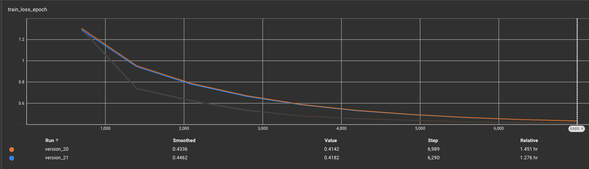
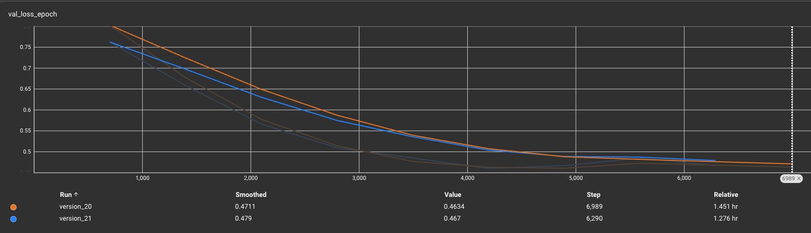
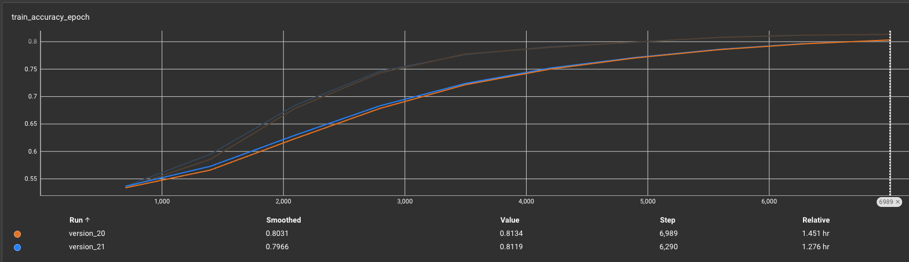
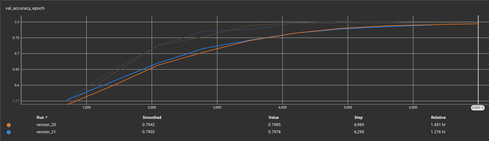

# SASRec: Self-Attentive Sequential Recommendation

This directory contains the implementation of SASRec.

## Description

SASRec is a self-attentive sequential recommendation model proposed in the paper [Self-Attentive Sequential Recommendation](https://arxiv.org/abs/1808.09781). It is designed to effectively capture sequential patterns in recommendation tasks.

## Dataset

The dataset used in this project is the [Amazon Reviews 2023, Video Games](https://amazon-reviews-2023.github.io/) dataset. It contains a collection of reviews for video games from the year 2023. This dataset is a valuable resource for training and evaluating recommendation models, such as SASRec. It provides a diverse range of user preferences and opinions, allowing for comprehensive analysis and accurate recommendations.

## Model

Use SASRec for self-attentive sequential recommendation. For more references, check out the [SASRec: Self-Attentive Sequential Recommendation](https://arxiv.org/abs/1808.09781) paper.

The following is the model architecture used in this repository.

```txt
====================================================================================================
Layer (type:depth-idx)                             Output Shape              Param #
====================================================================================================
SASRecModule                                       [1024, 50, 128]           --
├─SASRec: 1-1                                      [1024, 50, 128]           --
│    └─TransformerEmbeddings: 2-1                  [1024, 50, 128]           --
│    │    └─IdEmbeddings: 3-1                      [1024, 50, 128]           --
│    │    │    └─Embedding: 4-1                    [1024, 50, 128]           10,704,896
│    │    └─Embedding: 3-2                         [1, 50, 128]              6,400
│    │    └─LayerNorm: 3-3                         [1024, 50, 128]           256
│    │    └─Dropout: 3-4                           [1024, 50, 128]           --
│    └─ModuleList: 2-2                             --                        --
│    │    └─TransformerEncoderBlock: 3-5           [1024, 50, 128]           --
│    │    │    └─LayerNorm: 4-2                    [1024, 50, 128]           256
│    │    │    └─MultiheadAttention: 4-3           [1024, 50, 128]           66,048
│    │    │    └─LayerNorm: 4-4                    [1024, 50, 128]           256
│    │    │    └─PointwiseFeedForward: 4-5         [1024, 50, 128]           131,712
│    │    └─TransformerEncoderBlock: 3-6           [1024, 50, 128]           --
│    │    │    └─LayerNorm: 4-6                    [1024, 50, 128]           256
│    │    │    └─MultiheadAttention: 4-7           [1024, 50, 128]           66,048
│    │    │    └─LayerNorm: 4-8                    [1024, 50, 128]           256
│    │    │    └─PointwiseFeedForward: 4-9         [1024, 50, 128]           131,712
│    │    └─TransformerEncoderBlock: 3-7           [1024, 50, 128]           --
│    │    │    └─LayerNorm: 4-10                   [1024, 50, 128]           256
│    │    │    └─MultiheadAttention: 4-11          [1024, 50, 128]           66,048
│    │    │    └─LayerNorm: 4-12                   [1024, 50, 128]           256
│    │    │    └─PointwiseFeedForward: 4-13        [1024, 50, 128]           131,712
│    └─TransformerEmbeddings: 2-3                  --                        (recursive)
│    │    └─IdEmbeddings: 3-8                      [1024, 1, 128]            (recursive)
│    │    │    └─Embedding: 4-14                   [1024, 1, 128]            (recursive)
│    │    └─IdEmbeddings: 3-9                      [1024, 1, 128]            (recursive)
│    │    │    └─Embedding: 4-15                   [1024, 1, 128]            (recursive)
====================================================================================================
Total params: 11,306,368
Trainable params: 11,306,368
Non-trainable params: 0
Total mult-adds (Units.GIGABYTES): 33.29
====================================================================================================
Input size (MB): 0.43
Forward/backward pass size (MB): 1208.01
Params size (MB): 44.43
Estimated Total Size (MB): 1252.87
====================================================================================================
```

## Results

Here are the results of the model:

| metrics | train  | val |
| ------------- | ------------- | ------------- |
| loss | 0.4142 | 0.4634 |
| accuracy | 0.8134 | 0.7985 |

These metrics were calculated per epoch.

Here are the loss and accuracy plots for the training and validation sets:

| metrics | train  | val |
| ------------- | ------------- | ------------- |
| loss |  |  |
| accuracy |  |  |

todo

- []: Eval ranking metrics (e.g. NDCG, MRR) for validation.

## Usage

To train the model, follow these steps:

1. Clone the repository:

```sh
git clone https://github.com/haru-256/ml-sandbox.git
```

2. Navigate to the Transformer directory:

```sh
cd ml-sandbox/transfomer
```

3. Install the required dependencies:

```sh
uv sync
```

4. Run the training command:

```sh
make train
```

This command will initiate the training process and start training the Transformer model using the IMDB Dataset. The training progress and accuracy will be displayed in the console.

Note: Make sure you have [uv](https://github.com/astral-sh/uv) and Make installed on your system before running the above commands.

## References

- [SASRec: Self-Attentive Sequential Recommendation](https://arxiv.org/abs/1808.09781)
- [Amazon Reviews 2023](https://amazon-reviews-2023.github.io/)
